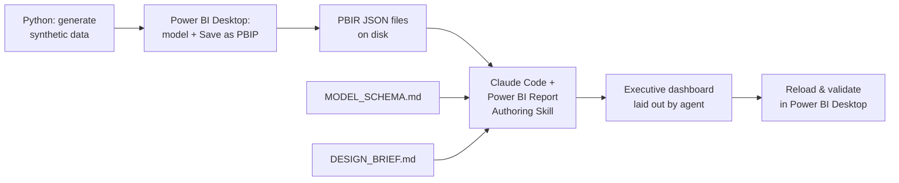
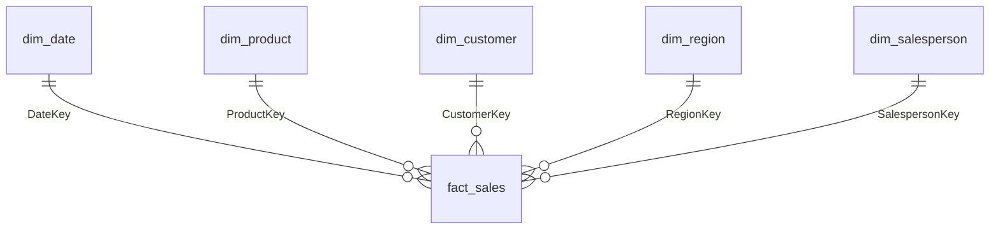

# AI-Assisted Power BI Report Development

Building a modern executive dashboard using an **AI agent workflow** — where the report is authored as code (PBIP/PBIR) and an AI agent lays out the visuals from a natural-language brief, instead of dragging every element by hand.

> ⚠️ Built entirely on a **synthetic dataset** (fictional retail-gadget company). No confidential or production data is used.

---

## TL;DR

Traditional Power BI report building is manual: drag fields, position visuals, click through the formatting pane. This project explores a different approach — save the report as a **Power BI Project (PBIP)**, which breaks the report down into human- and machine-readable **PBIR JSON** files, then let an AI agent (running in Claude Code with Microsoft's *Power BI Report Authoring Skill*) design the layout while I focus on the data model and the business questions.

**Core lesson learned:** *context is everything.* The more structure I hand the agent — semantic model schema, a written design brief — the closer the output lands to intent.

---

## What this project demonstrates

- **Dimensional modeling** — a clean star schema (1 fact + 5 dimensions) built for analytics
- **AI-assisted report authoring** — PBIP/PBIR as the "source code" of a report, edited by an agent
- **Semantic modeling** — relationships, a marked date table, DAX measures (time-intelligence: YTD, YoY)
- **Data storytelling** — an executive dashboard: KPIs, trends, geography, and segment mix
- **Reproducible engineering** — synthetic data generated with Python, version-controlled with Git
- **Prompt & context design** — schema docs + design brief as agent context

---

## The workflow



Because `.pbix` is a sealed binary, no agent can read it. Saving as **PBIP** turns the report into plain-text PBIR JSON — pages, visuals, filters, and formatting all become files an agent can open, understand, and edit like code.

---

## Data model

Star schema — currency in IDR, date range 2023–2025, 12,000 sales rows.



| Table | Rows | Role |
|---|---|---|
| `fact_sales` | 12,000 | Sales transactions (Quantity, SalesAmount, COGS, Profit) |
| `dim_date` | 1,096 | Date dimension (marked as date table) |
| `dim_product` | 20 | Products across 7 categories |
| `dim_customer` | 300 | Customers by segment (Consumer / SME / Corporate) |
| `dim_region` | 20 | Indonesian cities with lat/long for maps |
| `dim_salesperson` | 12 | Sales reps by regional team |

Full schema, relationships, and suggested DAX measures: [`docs/MODEL_SCHEMA.md`](docs/MODEL_SCHEMA.md)

---

## Dashboard

*(screenshot to be added after the agent generates the layout)*

Planned executive dashboard:
- KPI row — Total Sales, Total Profit, Profit Margin %, Total Orders (with YoY%)
- Sales trend by month (seasonality: Q4 + Ramadan/Lebaran peaks visible)
- Sales by product category
- Sales by city (map)
- Contribution by customer segment
- Slicers — Year, Island, Segment

---

## Tech stack

`Power BI (PBIP/PBIR)` · `DAX` · `Claude Code` · `Microsoft Power BI Report Authoring Skill` · `Python (pandas, numpy)` · `Git`

---

## Repository structure

```
.
├── README.md
├── data/                     # synthetic dataset (CSV + Excel)
│   ├── RetailGadget_DummyData.xlsx
│   ├── fact_sales.csv
│   └── dim_*.csv
├── docs/
│   ├── MODEL_SCHEMA.md       # model structure & DAX measures (agent context)
│   └── DESIGN_BRIEF.md       # visual design brief (agent context)
├── report/                   # Power BI Project (PBIP)
├── scripts/
│   └── generate_data.py      # reproducible data generator
└── images/
    └── dashboard.png
```

---

## Reproduce it

1. Generate the data: `python scripts/generate_data.py`
2. Import into Power BI Desktop, build relationships, mark `dim_date` as the date table, set geo data categories on `dim_region`.
3. **Save As → Power BI Project (.pbip)**.
4. Install the authoring skill in Claude Code:
   ```
   /plugin marketplace add microsoft/skills-for-fabric
   /plugin install powerbi-authoring@fabric-collection
   ```
5. Run `claude` inside the PBIP folder and prompt the agent, pointing it at `MODEL_SCHEMA.md` and `DESIGN_BRIEF.md`.
6. Reload in Power BI Desktop to validate.

---

## Key takeaways

- **PBIP unlocks AI-assisted BI.** Text-based report definitions make reports programmable.
- **Context beats prompting.** Every extra piece of structured context — schema, design brief — measurably improves the agent's output.
- **Treat reports like source code.** Commit a clean baseline before each agent session; the PBIR files are the source of truth.
- **The human stays in the loop.** The agent handles layout mechanics; modeling, validation, and business judgment stay with me.

---

## About

**Muhammad Rafan Pradipta (Fan)** — Data Analyst | Microsoft Fabric DP-600 certified
Data Science graduate, exploring the intersection of AI agents and business intelligence.

📫 [LinkedIn](#) · [GitHub](#)
